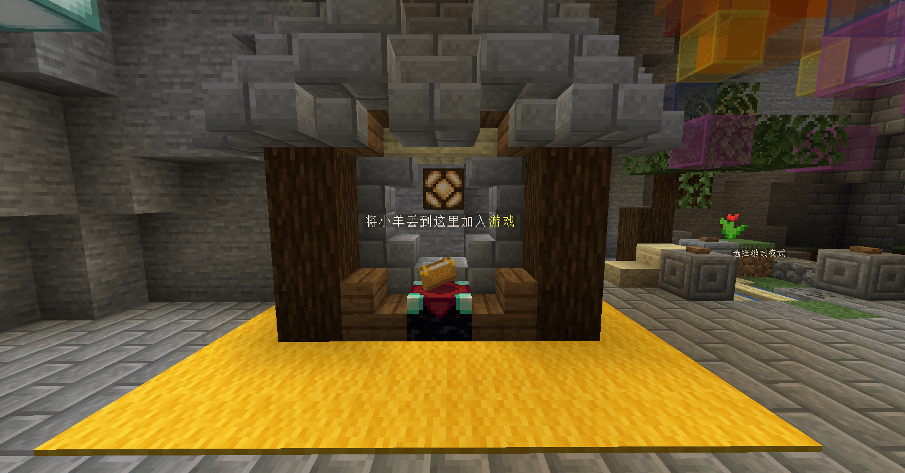
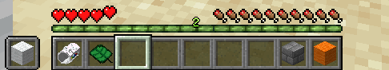
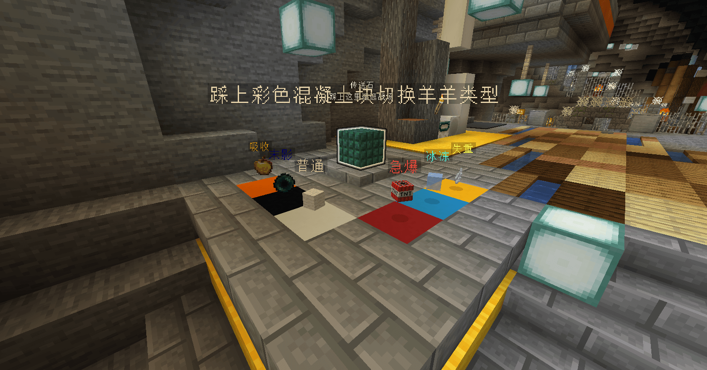

# 小游戏竞赛初赛

初赛阶段将进行至多 8 场比赛，每场比赛至多 32 人参与。报名参与小游戏竞赛的用户可在报名结束前选择自己参与的场次，如未选择参与的场次，则将由运营组随机安排。场次安排情况将于报名结束次日凌晨发布，请留意。

**比赛时间场次和可能根据报名情况变更**，请注意关注五周年庆典玩家群、[活动时间表](/5thAnniv/schedule.html) 和我们的 Twitter 账号，以获取活动的最新动态。

08/20/2021 晚更新：各场次列表已生成，请 [_点此查看 >>>_](./players/preliminary.html)

08/22/2021 晚更新：初赛晋级选手列表已公布，请 [_点此查看 >>>_](./players/promoted/preliminary.html)

::: warning
本轮比赛需使用专用材质包，否则可能无法正常游戏。材质包下载地址请见下方 [地图信息](#地图信息) 部分。
:::

[[toc]]

## 地图信息

- 游戏地图：[地陷圣坛](https://www.mcbbs.net/thread-908503-1-1.html)
- 游戏模式：个人 - 死亡竞赛
- 游戏版本： 1.14.4
- 专用资源包：**需要**，[_点击下载 >>>_](https://littleskin-resource.littleservice.cn/5thAnniv/sheepooia.zip)
- 地图制作团队：Command Block Logic

## 比赛规则

### 确认参与

请提前至少五分钟进入游戏服务器。游戏开始前，请先将主手上的物品切换到羊羊大炮（物品栏第一位），将羊羊发射到大厅左侧的附魔台上，以确认参与比赛，否则无法进入比赛。

### 单场游戏时长

五分钟。

### 得分规则

每击杀一人可获得 10 分，自杀扣除 5 分。

### 晋级规则

每场比赛得分前 8 名的选手可晋级至复赛。如存在分数相同的情况，则取最早取得该分数的玩家晋级。

## 游戏玩法

羊羊大炮可发射具有爆炸伤害的羊羊；而芭蕉扇可以将身边的羊羊或玩家吹开。你需要击杀其它玩家以得分，同时防御来自其它玩家的攻击。被击杀后可以复活。

连续发射羊羊需要冷却，冷却时间将在经验栏显示；多次使用芭蕉扇需要冷却，芭蕉扇可使用的次数将显示为等级，冷却时间将在经验栏显示。

- 第一格物品：羊羊大炮
  - 右键能够发射神奇羊羊，是你参战的主要武器；  
- 第二格物品：芭蕉扇
  - 拥有驾驭风的力量，右键挥动可吹动玩家和羊羊。

在游戏开始前，玩家可通过踩上大厅中不同颜色的混凝土块，选择不同属性的羊羊。如果你在游戏中死亡，请站到石砖上以返回战场。

### 羊羊属性

#### 失重

- 羊羊将不受重力影响直直前进。飞行距离越远伤害越高，与此同时主人的移动速度将会加快；
- 手持羊羊大炮按 <kbd>F</kbd> 即可在小白羊和小黄羊之间切换。

#### 冰冻

 - 落地后羊羊会生成雪花阵， 逐渐降低阵内敌人的移动速度，直到将敌人完全冻住。被冻住时更无法挥动扇子，且主人将免疫冰冻效果；
 - 手持羊羊大炮按 <kbd>F</kbd> 即可在小白羊和小冰羊之间切换。

#### 急爆

 - 落地后羊羊将会立刻爆炸；
 - 主人的最大扇子次数将增大；
 - 手持羊羊大炮按 <kbd>F</kbd> 即可在小白羊和小红羊之间切换。

#### 末影

 - 羊羊会将它的主人传送到它落地的位置并将主人能量充满；
 - 手持羊羊大炮按 <kbd>F</kbd> 即可在小白羊和小黑羊之间切换。

#### 吸收

 - 落地后羊羊在附近生成吸收阵, 其中的队友会获得伤害吸收，与此同时主人的生命上限将变高；
 - 手持羊羊大炮按 <kbd>F</kbd> 即可在小白羊和小橙羊之间切换。

#### 普通

 - 虽然能力普通，但是总能量高。

### 超级羊羊

在游戏中攻击其它玩家可为羊羊大炮充能，当羊羊大炮充能完毕后，可根据游戏界面提示释放超级羊羊。超级羊羊拥有更大的攻击力和属性加成，但释放超级羊羊时的你会非常脆弱。
