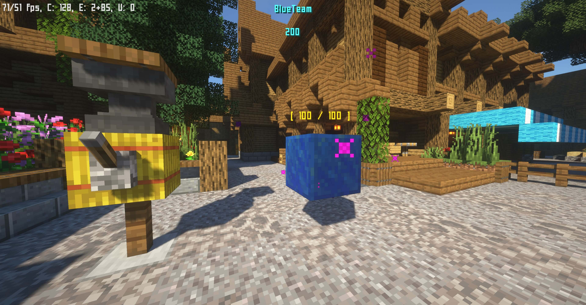
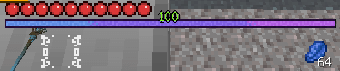

# 小游戏竞赛复赛

复赛阶段将进行至多 8 场比赛，每场比赛至多 2 组团队（8 人）参与。晋级复赛的团队可在复赛第一天上午 10 时前选择自己参与的场次，如未选择参与的场次，则将由运营组随机安排。场次安排情况将于复赛第一天中午 12 时前公布，请留意。

08/23/2021 早更新：复赛各场次玩家列表及晋级名单已发布，请 [_点此查看 >>>_](./players/quaterfinal.html)

::: warning
本轮比赛需使用专用材质包，否则可能无法正常游戏。材质包下载地址请见下方 [地图信息](#地图信息) 部分。
:::

[[toc]]

## 地图信息

- 游戏地图：[ElementsBattle](https://www.mcbbs.net/thread-891679-1-1.html)
- 游戏模式：团队 - 掠夺模式
- 游戏版本： 1.16.2
- 专用资源包：**需要**，[_点击下载 >>>_](https://littleskin-resource.littleservice.cn/5thAnniv/eb_resourcespack.zip)
- 地图制作团队：The Command's Power

## 比赛规则

### 队伍选择

选手需要在 30 秒内走入中间自己的队伍的颜色的区域，以选择队伍。

未选择队伍的选手在比赛正式开始后将切换为旁观模式，无法参与比赛。

::: danger
请注意选择自己的队伍，一旦倒计时结束就不能再退出队伍。
:::

### 准备游戏

游戏进入准备阶段后。请手持你喜欢的一个法杖并右键它。选择后它将会出现在墙上，表示你已选择法杖。

选择完法杖后，请打开背包，点击第三行第一个物品进行准备。

所有选手都准备完成或倒计时结束时，比赛将自动开始。

### 得分规则

团队内有选手持有魔灵石块即可得分，单个魔灵石块最多 100 分。当单个魔灵石块累计得分达到 100 时将重新生成魔灵石块。

持有魔灵石块的玩家被击杀后，击杀者将掠夺被击杀的玩家的魔灵石块，被击杀的玩家的团队将得到魔灵石被掠夺前得分的 50%。

### 晋级规则

每场游戏中最先获得 1200 分的团队即为该局比赛的优胜团队；在三局比赛中率先取得两局优胜的团队可晋级至决赛。

## 游戏玩法

地图上将随机出现魔灵石块，选手需抢夺并持有魔灵石以得分。持有魔灵石的玩家必须设法躲避其他玩家的追击，保护好你身上的魔灵石。

在进入服务器后，你可以图书馆（出生点处）了解游戏详情，也可以在大厅后面的墙选择一个法杖与其他玩家进行试玩，还可以点击背包第一行第九格的物品进行基础教程。

### 法杖属性

不同的法杖拥有不同的属性和技能。你可以可以打开背包，将光标悬浮在法杖和技能（附魔书）上，查看各个法杖和技能的详情。

### 技能释放

技能释放存在冷却时间且需要消耗法力值，法力值将在经验栏显示。

- 单击右键进行技能释放；
- 按住 <kbd>Shift</kbd> 并单击右键进行强化技能释放；
- 按住 <kbd>Shift</kbd>，听到三次提示音后单击右键进行蓄力技能释放；
- 按 <kbd>F</kbd> 释放特殊技能；
- 按 <kbd>Q</kbd> 释放位移技能。

### 技能升级

每个法杖的五个技能分别位于背包中行的中间五个附魔书，从左到右依次是技能一到技能五，每个技能最高可以升级到五级。

每升级一次技能，需要消耗 5 个魔灵石。魔灵石位于快捷栏第九格，可以通过击杀敌方或存活一段时间获得。

### 游戏提示

地图的某个地方会出现药水，靠近即可拾起并获得附加效果增益！

