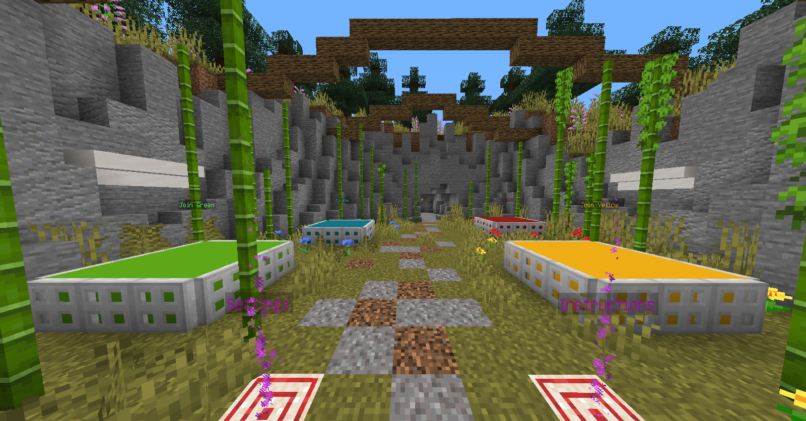
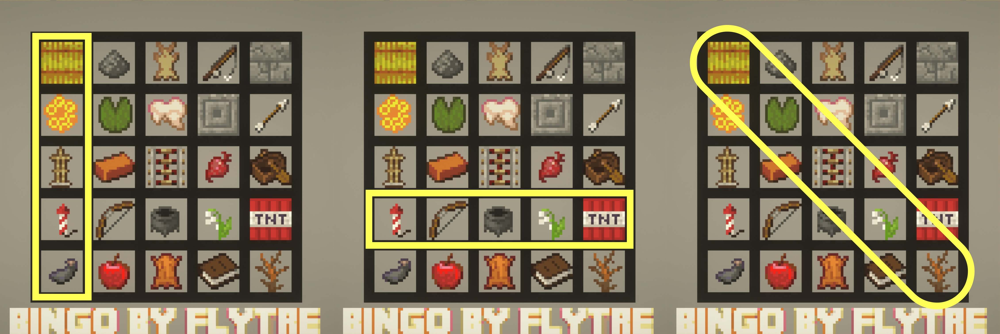
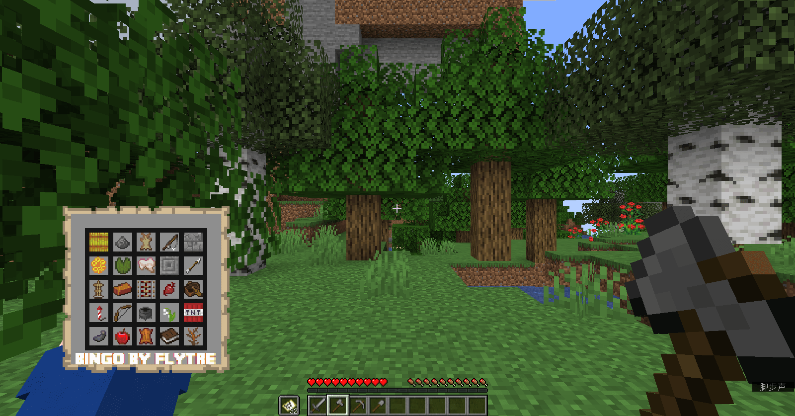

# 小游戏竞赛半决赛

半决赛阶段将进行至多 2 场比赛，每场比赛至多 16 人参与。晋级半决赛的团队可在半决赛当天上午 10 时前选择自己参与的场次，如未选择参与的场次，则将由运营组随机安排。场次安排情况将于半决赛当天中午 12 时前公布，请留意。

08/25/2021 早更新：半决赛各场次选手列表及晋级名单已发布，请 [_点此查看 >>>_](./players/semifinal.html)

[[toc]]

## 地图信息

- 游戏地图：[Bingo](https://www.flytre.net/bingo)
- 游戏模式：Manhunt
- 游戏版本： 1.16.5
- 专用资源包：不需要
- 地图制作团队：Flytre Maps

## 比赛规则

### 队伍选择

游戏开始后不会自动分配队伍，玩家需手动进入自己的队伍。

站上游戏大厅中代表各队伍的颜色的区域即可加入对应的队伍。

### 获胜方法

红队：击杀黄、绿、蓝队所有的玩家

黄、绿、蓝队：达成 Bingo，即在集齐在 Bingo Board 上的一排、一列或对角线上的 5 个物品。

最先获胜的团队即为优胜团队，可晋级至决赛。

除优胜团队之外，我们还将选取每场比赛中收集 Bingo Board 上任务物品最多的团队，评为「最速传说」团队，晋级至决赛。

## 游戏玩法

游戏开始时，Bingo Board 上会生成 25 个随机物品（即 Bingo 物品），并给予你 Bingo Board（左手）和工具（快捷栏）。

红队需击杀场上所有其它队伍的玩家，方可获得胜利；黄、绿、蓝队的玩家需要收集这些物品，达成 Bingo 以取得胜利。

各个队伍将会分散在不同的区域。各个队伍可以互相靠近，并和其他队伍进行 PvP。黄、绿、蓝队玩家只有 8 点生命值（4 颗心），死亡后物品将会掉落，且不可复活；红队玩家有 20 点生命值（10 颗心），死亡后物品将掉落，但可复活。

当你获得一件新的 Bingo 物品时，手持地图并扔出它以更新 Bingo Board。

### 可以使用的指令

1. 如果你不确定 Bingo Board 上的物品，可以使用 `/trigger clarify set [1-25]` 查询此物品的名称。`[1-25]` 为物品所在格的编号，从左到右、从上到下逐格依次递加；

2. 使用 `/trigger team_tp {playername}` 以随机传送到一个的队友身边；

4. 如果你不小心丢失了你的 Bingo Board，请使用 `/trigger give_map` 以重新获取。