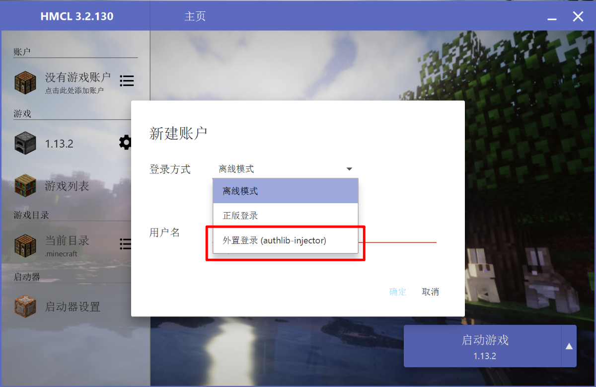
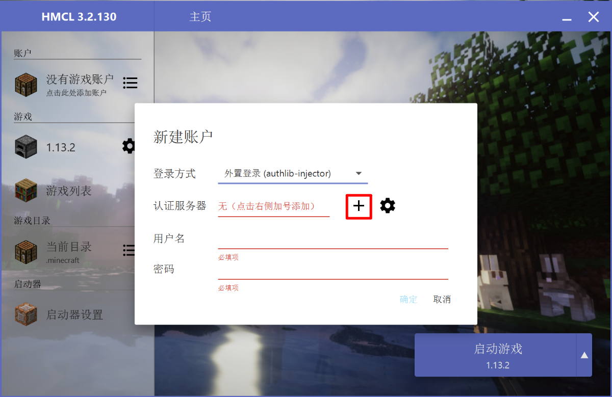
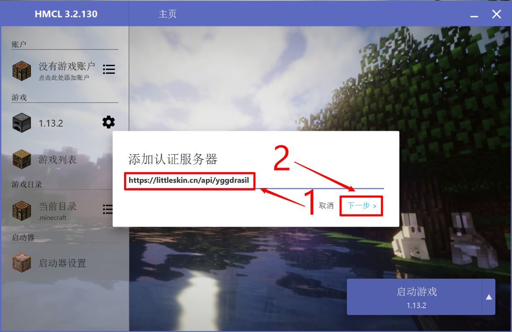
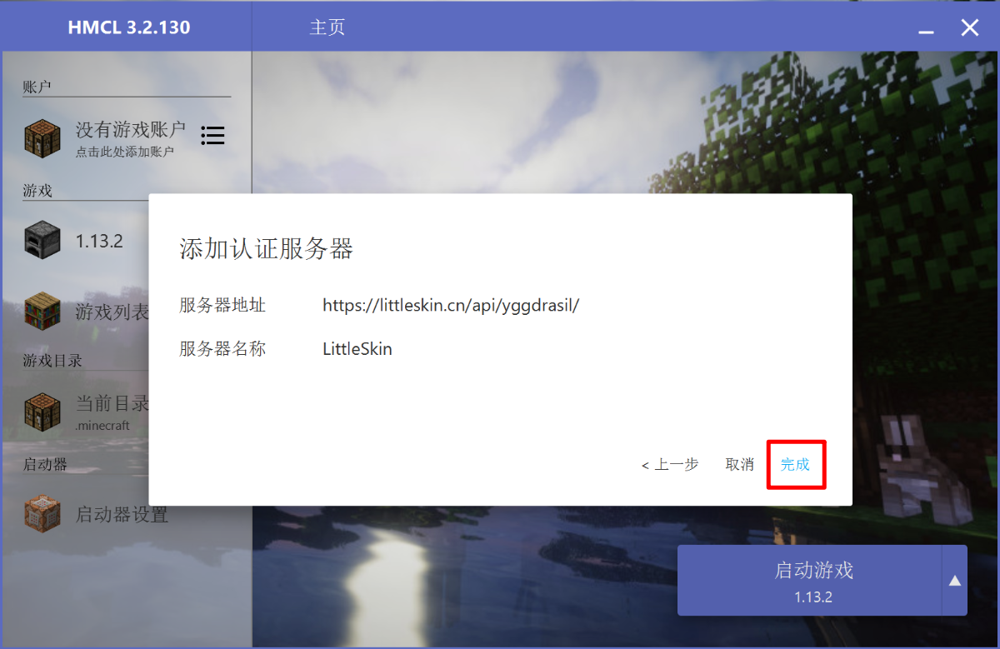
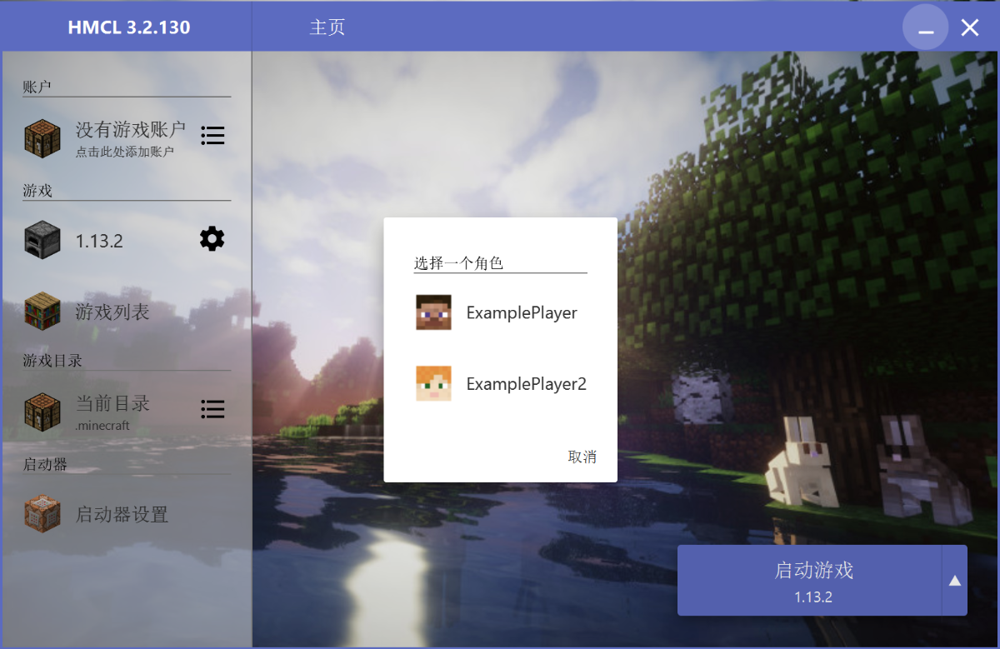

# Yggdrasil

LittleSkin 提供 Yggdrasil 验证鉴权服务。你可以配合 [authlib-injector](https://github.com/yushijinhun/authlib-injector) 来实现 Minecraft 服务器外置登录，并在不安装皮肤 Mod 的情况下加载来自 LittleSkin 的材质。

你可以在 [https://authlib-injector.yushi.moe/~download/](https://authlib-injector.yushi.moe/~download/) 下载到最新版本的 authlib-injector。

## Yggdrasil API 地址
LittleSkin 的 Yggdrasil API 的地址是：

```
https://littleskin.cn/api/yggdrasil
```

LittleSkin 已在全站启用 authlib-injector 的 API 地址指示（ALI）功能。在使用支持 ALI 的 authlib-injector 和启动器时，输入 LittleSkin 的任意页面的地址即可被识别。

## API 文档

请参阅：[Yggdrasil 服务端技术规范](https://github.com/yushijinhun/authlib-injector/wiki/Yggdrasil%E6%9C%8D%E5%8A%A1%E7%AB%AF%E6%8A%80%E6%9C%AF%E8%A7%84%E8%8C%83)

## 在服务端使用

请先将服务器配置文件（一般为 server.properties）中 `online-mode` 一项的值设为 `true`，然后在你的服务端的启动指令的 `-jar` 参数前添加如下参数：

```
-javaagent:{path/to/authlib-injector.jar}=https://littleskin.cn/api/yggdrasil
```

其中 `{path/to/authlib-injector.jar}` 为指向 authlib-injector 的路径。

::: warning
<strong>实际填写的路径两边没有大括号！</strong>大括号只是表明必须正确指定这个参数的值，但是实际上并不需要填入大括号。
:::

::: tip
如果你使用 BungeeCord，你需要在所有服务端（包括 BungeeCord 和所有子服）中加载 authlib-injector（方法见上），但只有 BungeeCord 打开 `online-mode`，其他服务端应该关闭 `online-mode`。
:::

## 在客户端使用

在客户端中使用 LittleSkin 的 Yggdrasil 需要启动器支持自定义 Yggdrasil 服务器。推荐使用 [HMCL 3](https://www.mcbbs.net/thread-142335-1-1.html)。

::: tip
如果你使用的启动器不支持自定义 Yggdrasil，并且你使用的启动器是使用 Java 编写的，你也可以手动添加 JVM 参数来加载 authlib-injector（就像在服务端使用 authlib-injector 一样），但是本文不介绍这种做法。
:::

以下以 HMCL 3 为例，演示在 Minecraft 客户端中使用 Yggdrasil。

1. 打开 HMCL 3 的「新建游戏账户」界面，选择登录方式为「外置登录（authlib-injector）」。   
如果这是你第一次打开 HMCL，这个界面将会在启动时弹出。



2. 点击「认证服务器」旁的加号「+」，输入 LittleSkin 的 Yggdrasil API 地址，点击「下一步」，等待识别出 LittleSkin 的 Yggdrasil 后点击「完成」。   
如果你曾经添加过 LittleSkin 的 Yggdrasil，你也可以在「认证服务器」菜单中直接选择 LittleSkin。







3. 在「认证服务器」菜单中选择 LittleSkin，填写你的邮箱和密码。「用户名」即为你在 LittleSkin 的账号的邮箱。   
如果你只添加了一个认证服务器，那么 HMCL 3 会默认选中那个唯一的认证服务器。


4. 选择你的游戏角色。   
如果你只有一个角色，那么 HMCL 3 会默认选择那个唯一的角色。   
如果你希望添加多个角色，你可以再次添加你的账号来添加另一个角色。



5. 设置完成啦！你可以启动游戏了。


## 参考链接

- [在 Minecraft 服务端使用 authlib-injector](https://github.com/yushijinhun/authlib-injector/wiki/%E5%9C%A8-Minecraft-%E6%9C%8D%E5%8A%A1%E7%AB%AF%E4%BD%BF%E7%94%A8-authlib-injector)
- [配合 authlib-injector 使用](https://github.com/bs-community/yggdrasil-api/wiki/0x03-配合-authlib-injector-使用)