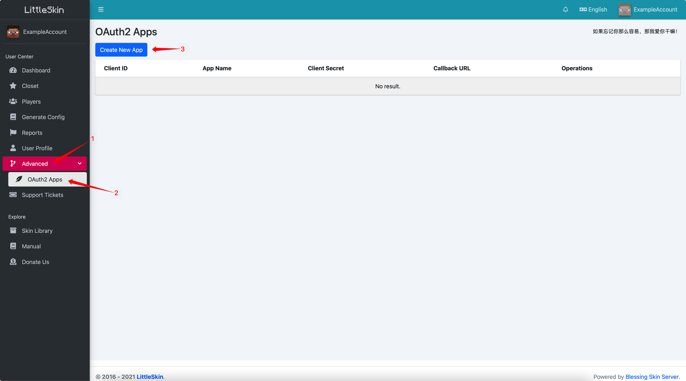
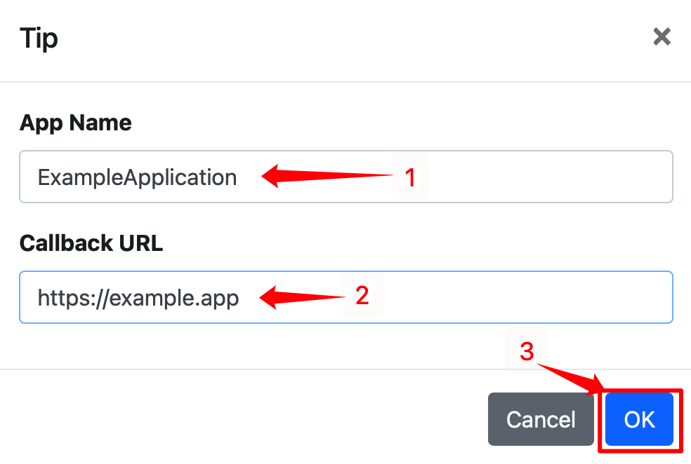

# OAuth 2

::: tip
This document is for developers, and ordinary users may not be able to understand it.

If you cannot understand what the page is talking about, just close it and read other documentation. Ignoring this part of the contents will not affect your use of the basic functions of LittleSkin.
:::

LittleSkin supports the OAuth2 server. You can integrate functions like "Log in with LittleSkin Account" in your application.

## Documentation

Please refer to [Blessing Skin 用户手册 - Web API - OAuth2 认证](https://blessing.netlify.app/api/oauth.html)(There's no English translation yet).

## Create OAuth 2 Application

Before integrating OAuth 2 into your website, you need to create an application in LittleSkin to get the client ID and Client Secret.

1. Open the OAuth 2 application management page, you can find the link in "Advanced", "OAuth2 Apps". Click on "Create New App".

2. Enter your App Name and Callback URL, click on "OK".

3. You've successfully created your OAuth 2 Application! You can find your OAuth 2 client ID and Client Secret on the page.