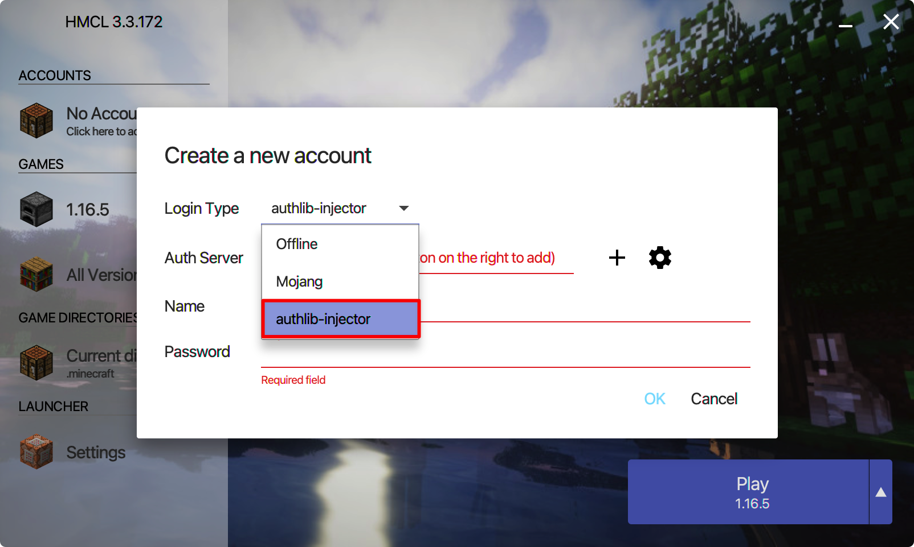
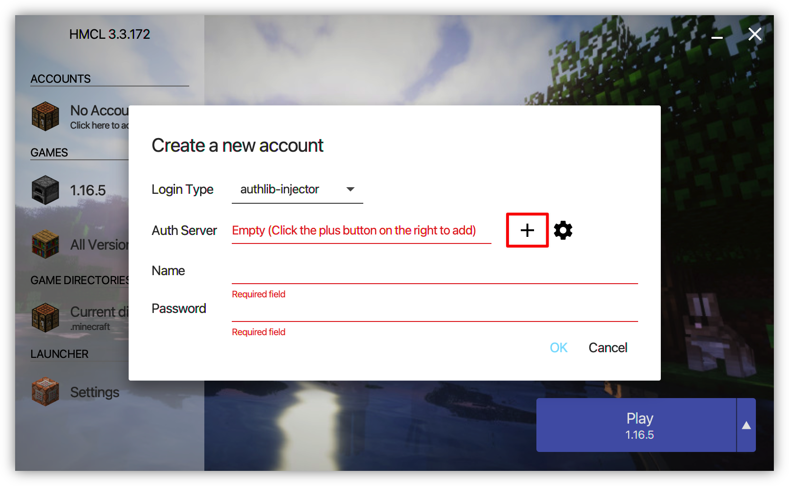
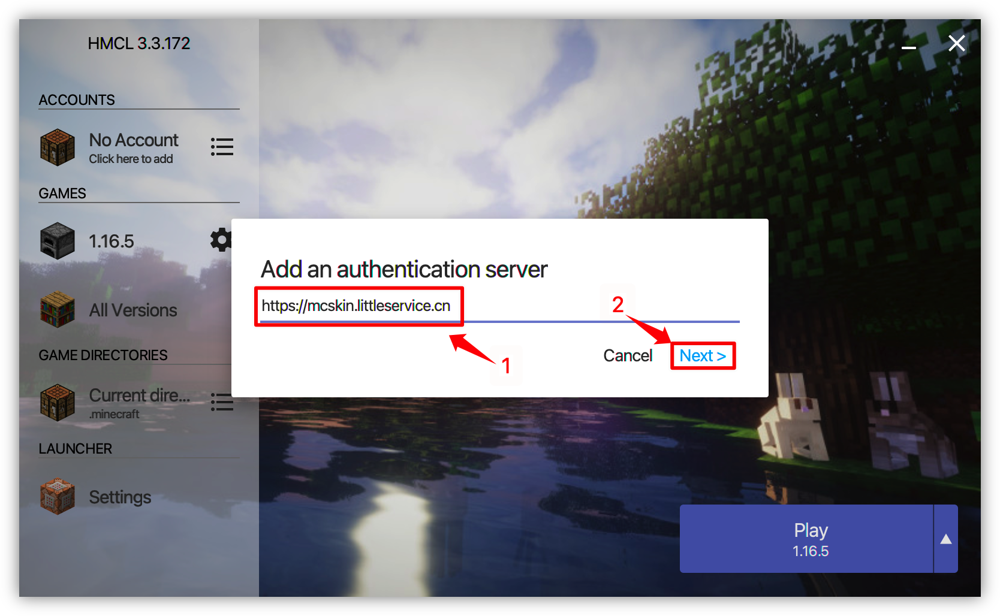
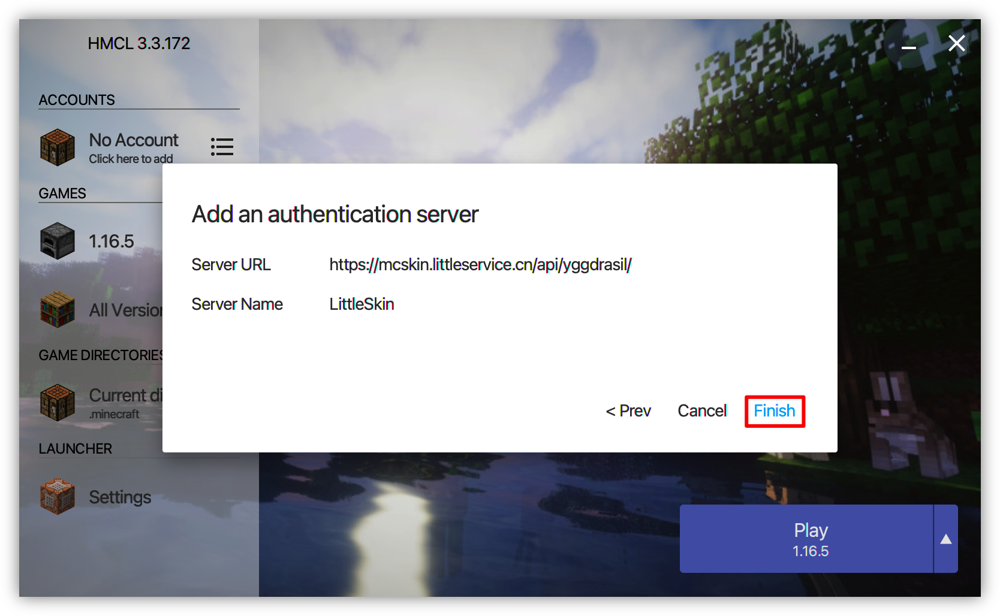
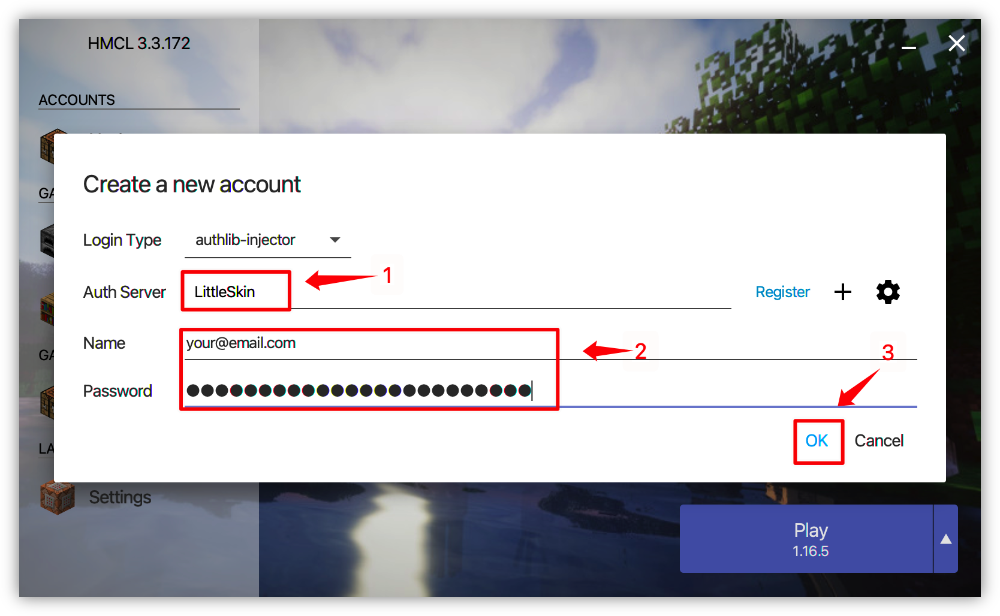
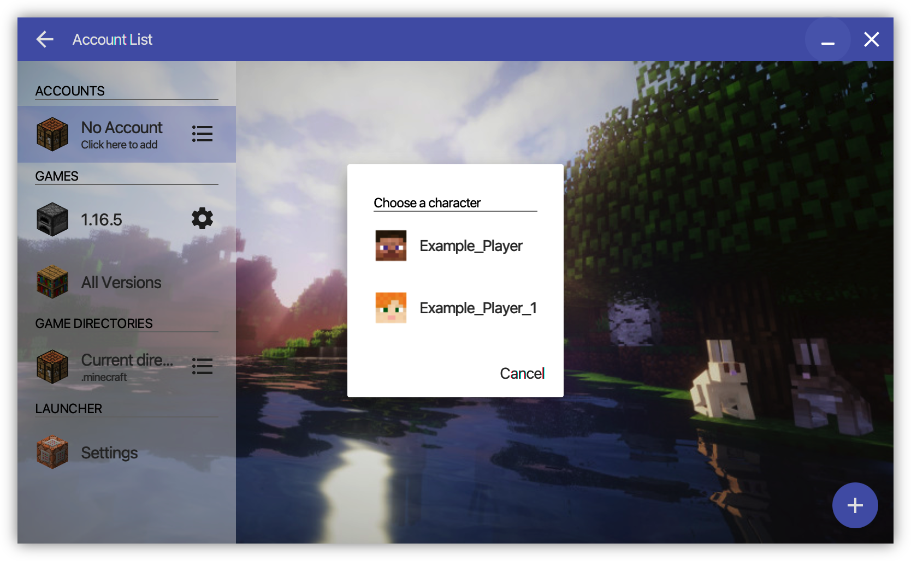

# Yggdrasil

LittleSkin provide Yggdrasil Verify Authentication Service. You can use it with [authlib-injector](https://github.com/yushijinhun/authlib-injector) to load skin from LittleSkin without skin loader mod.

You can download the latest version of authlib-injector at <https://authlib-injector.yushi.moe/~download/>

## Yggdrasil API address

The Yggdrasil API address of LittleSkin is:

```
https://littlesk.in/api/yggdrasil
```

LittleSkin has already active the API Address Indication (ALI) function of authlib-injector. When you are using launcher that supported authlib-injector of ALI, type any address of LittleSkin can be identified.

## API Documents

See: [Yggdrasil Server Technical Specifications](https://github.com/yushijinhun/authlib-injector/wiki/Yggdrasil%E6%9C%8D%E5%8A%A1%E7%AB%AF%E6%8A%80%E6%9C%AF%E8%A7%84%E8%8C%83)

## Use at server

Please change the `online-mode` value to `true` of server configuration file, and add this parameter before `-jar` of your server start command:

```
-javaagent:{path/to/authlib-injector.jar}=https://littlesk.in/api/yggdrasil
```

In this, `{path/to/authlib-injector.jar}` is the path that direct to authlib-injector.


::: warning
<strong>The path that you write isn't has big parantheses in real!<strong>The big parantheses is only show that must be assign this value correctly, but needn't write big paratheses in real.
:::

::: tip
If you're using BungeeCord, you need to load authlib-injector for all server(include BungeeCord and all sub servers), but you can only open `online-mode` of BungeeCord, keep closed for other server.
:::

## Use at client

Your launcher need to support custom Yggdrasil server if use Yggdrasil of LittleSkin in client. We are recommended to use [HMCL 3](https://www.mcbbs.net/thread-142335-1-1.html) and [BakaXL](https://www.mcbbs.net/thread-512144-1-1.html).

::: tip
If your launcher doesn't support custom Yggdrasil, but your launcher was written by Java, you can add JVM value by yourself to load authlib-injector(same as use authlib-injector at server), but at this document we won't show how to do this.
:::

We use HMCL 3 to set up an example to show how to use Yggdrasil in Minecraft Client.
  
1. Open the "Create a new account" page, select the login type as "authlib-injector".
If this is your first time to open HMCL, it will appear when it started.



2. Click the "+" at the right of auth server, type the Yggdrasil API address of LittleSkin, click "Next", wait for it identify the Yggdrasil of LittleSkin, then click "Finish".
If you already add the Yggdrasil of LittleSkin you can select LittleSkin at auth server list.







3.Select LittleSkin at auth server list, then type you E-Mail and password. "Name" is the E-Mail address of your LittleSkin account.
If you only add a auth server, so HMCL 3 will select the only auth server defaultly.



4.Select your character.
If you only have a character, so HMCL 3 will select the only character defaultly.
If you wanna add more characters, you can add your account again to add other character.



5.Setup is complete! You can start game now.

::: tip A point
For PCL2, you might be need to configure Yggdrasil server address by yourself at `Version settings` → `Settings` → `Server options`.

Login type：`Authlib-Injector`
Auth server：`https://mcskin.littleservice.cn/api/yggdrasil`
Register address：`https://mcskin.littleservice.cn/auth/register`
Server name：`LittleSkin`
:::

## Reference link

- [在 Minecraft 服务端使用 authlib-injector](https://github.com/yushijinhun/authlib-injector/wiki/%E5%9C%A8-Minecraft-%E6%9C%8D%E5%8A%A1%E7%AB%AF%E4%BD%BF%E7%94%A8-authlib-injector)
- [配合 authlib-injector 使用](https://github.com/bs-community/yggdrasil-api/wiki/0x03-配合-authlib-injector-使用)
- [BakaXL 使用指南 | 创建第三方验证模式 Minecraft 用户档案的窍门](https://www.bilibili.com/video/BV1W741197Bv)
