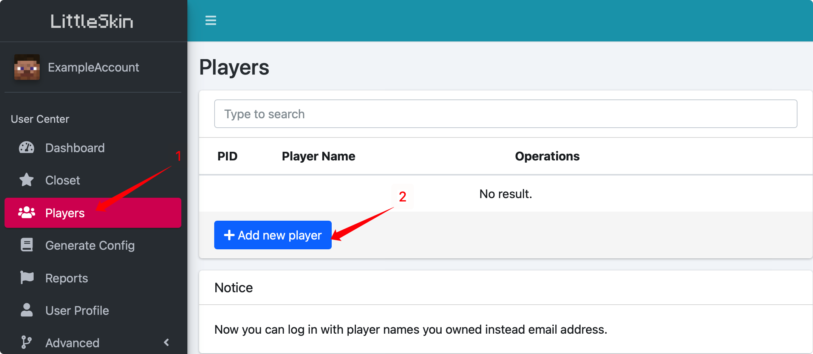
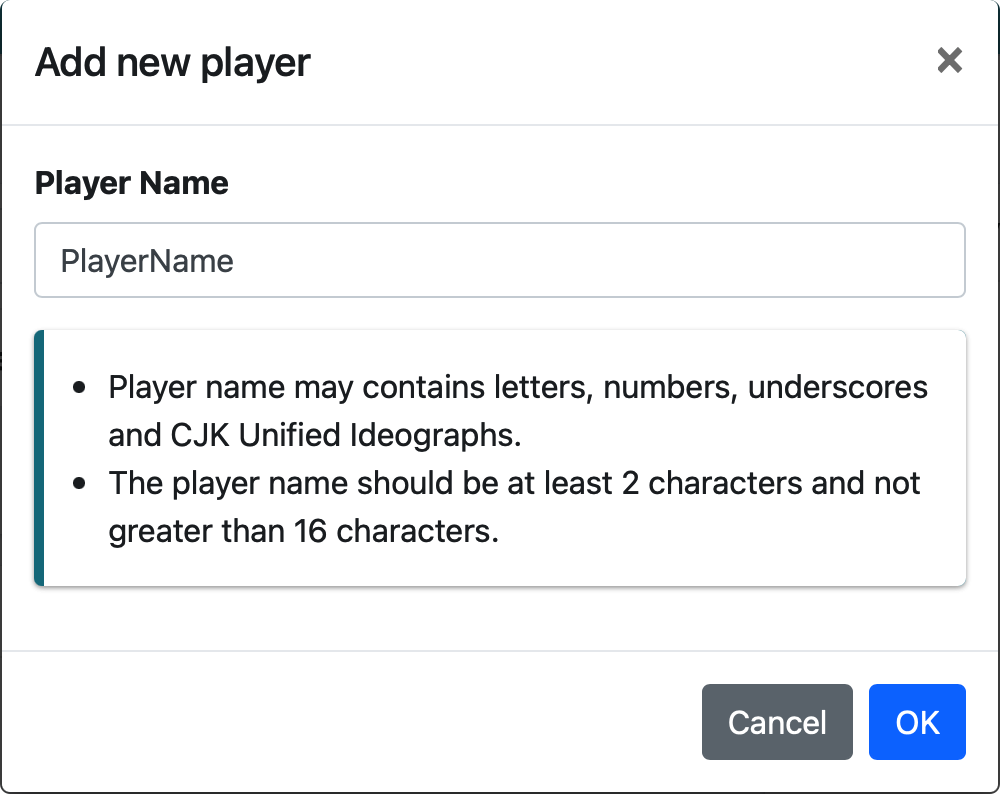

# Add a new player

Mods supported by LittleSkin are using the username to identify the player and load the skin. So you need to create your player to load the skin in Minecraft.

::: warning
You need to spend 100 scores to add a new player, it will be payback to you when you delete the player.    
Make sure you have enough score before you add the player, otherwise you won't be able to add one.
:::

You can add and manage your players by using the「Players」page in the user center:

1. Click on「Players」in the menu of user center, click on「Add new player」:

2. Type in your username in the popup window, and click on「OK」:

::: tip
You can use letters, numbers, underscores and CJK Unified Ideographs (Chinese, Japanese and Korean) in your player name.  
The player name should contain a minimum of 2 characters and a maximum of 16 characters.
:::

    
3. And you've successfully created your first player!   
If you want to create more players, you can also use the ways described in this documentation.

## Bind a Mojang Account

If you have a paid version of Minecraft, you can bind it to your LittleSkin account.

Binding your Minecraft account asks you to have the same email account in your LittleSkin account and your Mojang account. You can find「Bind Your Mojang Account」in the dashboard under the Announcement (if you cannot find it, please refresh your page), enter your password and it will be bind.

After the binding, we will automatically add an account using the same username as your paid Minecraft account (if a player is using this username, that player will be transferred to your account), and you can get scores rewards by binding your account.

Each LittleSkin account can only bind one Minecraft account.

::: tip
LittleSKin uses Mojang's Yggdrasil authentication system to verify your account, and it's also how Minecraft's official game launcher verify your account.

Your password will only be saved in LittleSkin's server's memory for a short time, LittleSkin won't save your password or provide it to third parties, so you can enter the password with confidence.
:::