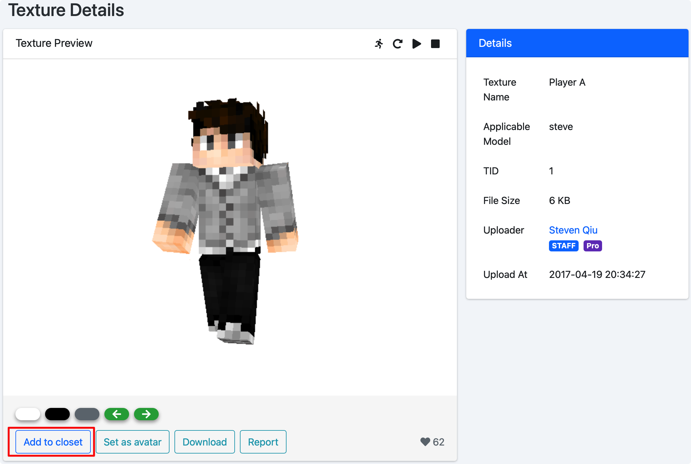
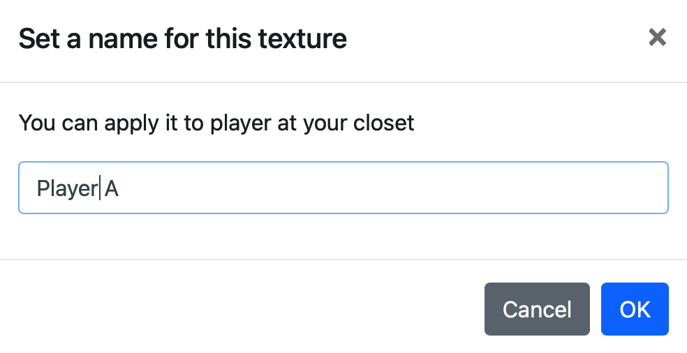
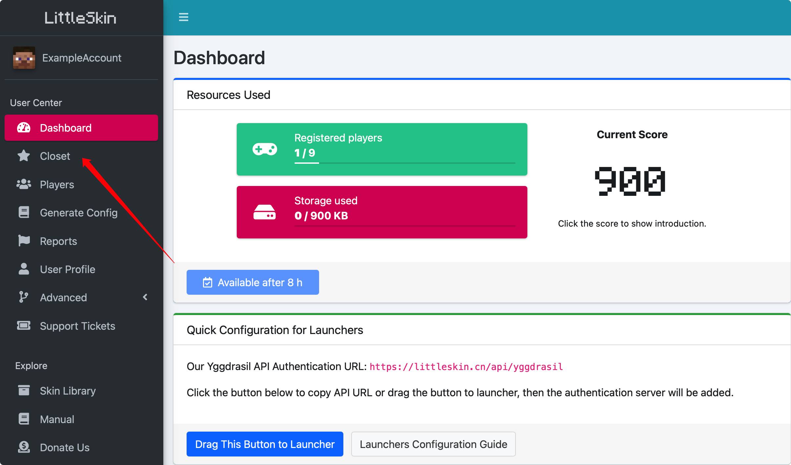
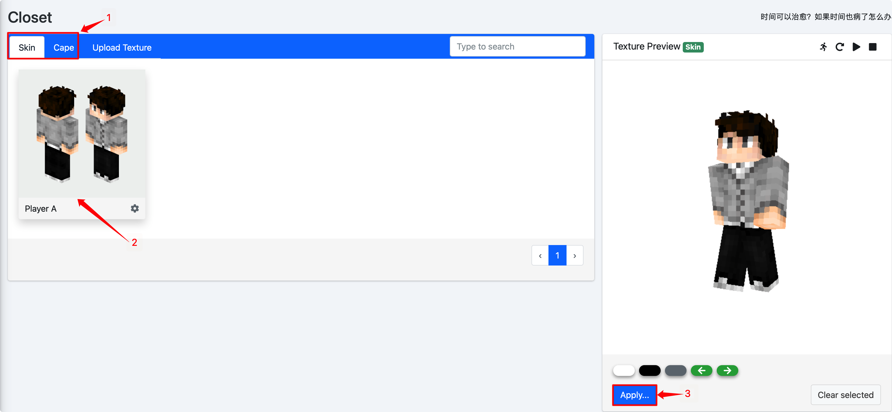
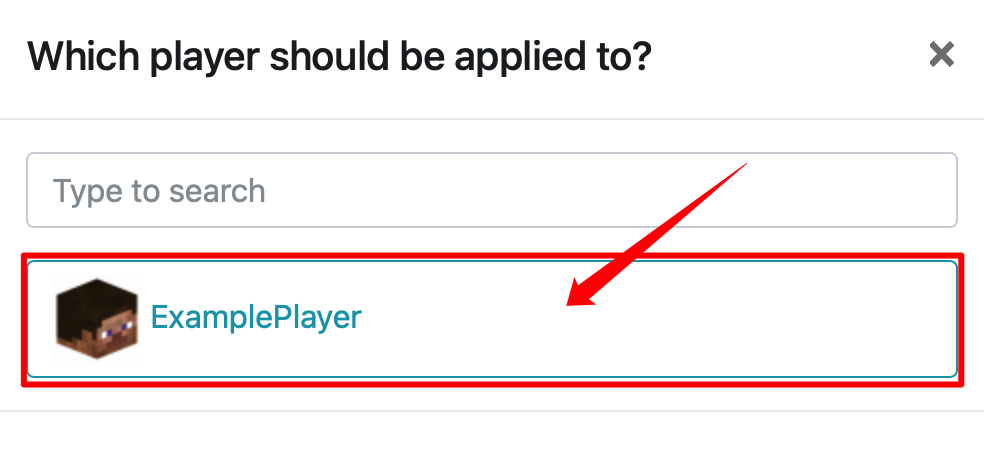
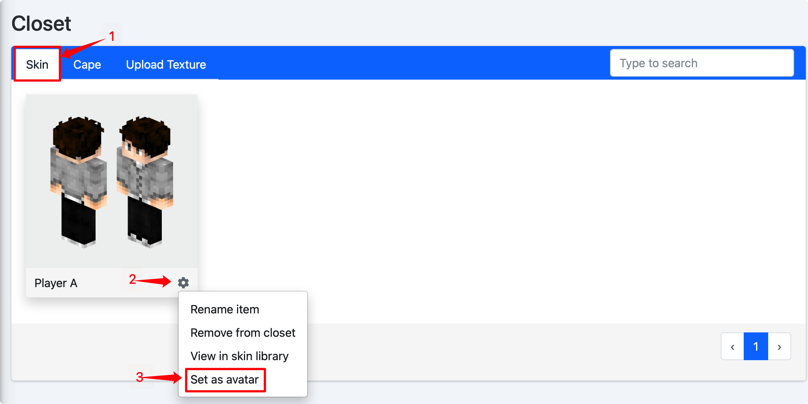

# Set the textures

After you create your player, you can apply the textures to your player.

You can upload your textures or just add textures from the Skin Library to your Closet.

## Upload your textures

If you have your file for the texture, you can upload it to the Skin Library. Only the textures in the Skin Library could be added to the closet.

LittleSkin supports single-layer skin (size 64\*32 or its integer multiple), double layer skin (size 64\*64 or its integer multiple) and 64\*32 capes (22\*17 capes are not supported), the texture of the elytra should be drawn directly on the cape. All the textures should be png format images.

::: tip
You will have to pay some scores to upload the textures, it will be counted regarding the size of your texture file. When your texture has been added by someone else, you will get scores rewards.

For public textures, every KB of storage will cost you 1 score. And for private textures, every KB of storage will cost you 20 scores. The score will be paid back when you delete the texture.

Every public texture can collect 10 scores while someone adds it to their closet. It will be removed when they delete it from their closet. 
:::

::: warning
The estimated score consumption displayed on the uploading page is for reference only, and the actual score consumption will be calculated based on the actual size of the texture file.
:::

1. log in to the Skin Library, click on the「Upload new skin」on the top menu of the page

2. In the opened page, set your texture's name, type, upload your file and decide to make it private or not.   
You can see the preview of your texture at the right.   
When you complete the settings, click on「Upload」

::: danger
You are not allowed to upload these and other sensitive types of textures (including controversial materials) on LittleSkin :

- **High-Definition** pornographic sensitive textures
- Politically sensitive textures
- Any textures that violates the laws of Mainland China, Hong Kong Special Administrative Region and the United States

For these textures, you have to make them private while uploading them. Otherwise, if we find any of these textures, they will be deleted and you will be banned by LittleSkin forever.
:::

3. Then you've uploaded your texture!   
After the uploading process, you will be automatically redirected to the description page of the texture.   
The textures that you uploaded will be automatically added to your closet and you can go directly to「Closet」to view and apply your texture to your player.

## Add textures from Skin Library to the Closet
If the texture that you want is already in the Skin Library, you can directly add it to your closet and use it.

::: tip
Add a texture to the closet will cost you 10 scores, and it will be paid back when you delete it.
::::

1. Get into the description page of the texture, click on「Add to closet」under the skin's preview.

2. Set your texture's name in the popup window and click on「OK」

3. And it will be added to your closet!
After you add the texture, you can also directly apply it to your player on the description page.

## Apply the texture to the player
When you add the textures to your closet, you can apply them to your player.

You can use「Closet」in User Center to manage and apply the textures.

1. Click on the「Closet」in the left menu of User Center

2. Select the texture's type (skin/cape) at the top left corner of the page, select the texture that you want to apply and click on「Apply」under the preview at right.

3. Select the player that you want to apply the texture

4. And it will be applied to the player!

    If you want to change the texture or set the texture for other players, you can also use the way described in this documentation.

### Tip：Change your avatar

You can set the face of the skin as your LittleSkin avatar.

Select「Skin」in the closet, click on the gear button at the bottom right and click on「Set as avatar」. We will automatically crop the skin to get the avatar.

