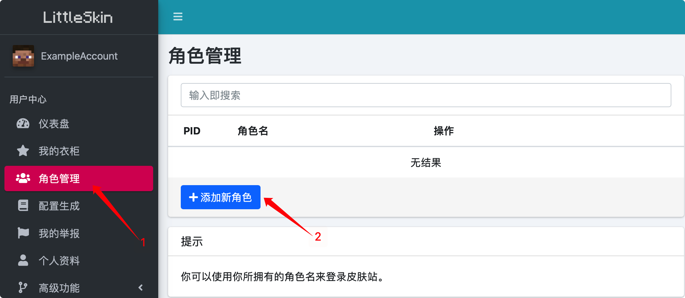
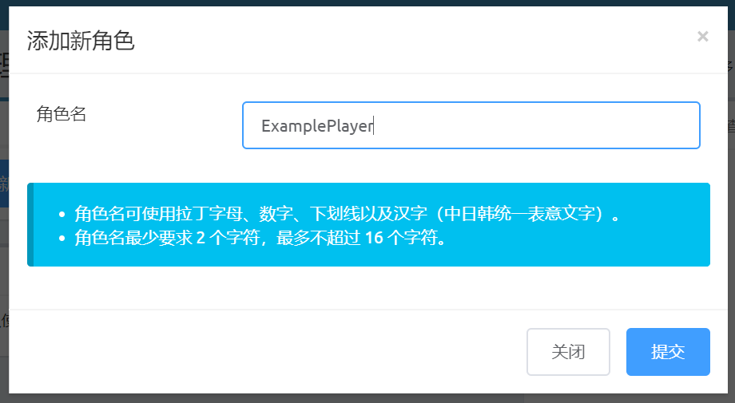

# 创建角色

LittleSkin 支持的皮肤 Mod 都是通过角色名来识别玩家身份并加载材质的，所以你需要先创建你的游戏角色才能在 Minecraft 中加载皮肤。

::: warning
创建一个角色需要花费 100 积分，而删除角色时会返还积分。   
在创建角色前请确保你的积分足够，否则你将无法创建角色。
:::

你可以在用户中心的「角色管理」页面创建和管理你的角色：

1. 点击用户中心左侧菜单栏中的「角色管理」，在打开的页面中点击「添加新角色」：

2. 在弹出的窗口中输入你的角色名，点击「提交」按钮：

::: tip
角色名可使用拉丁字母（英文字母）、数字、下划线以及中日韩统一表意文字（中文、日文、韩文）；   
角色名最短要求 2 字符，最长不超过 16 字符。
:::

    
3. 你的第一个角色就创建好啦~   
如果以后你还想创建更多角色，也可以按照这份文档中所述的方法操作。

## 绑定正版角色

如果你拥有正版 Minecraft，你可以将其绑定至你的 LittleSkin 账号。目前我们支持绑定 Mojang 账号和绑定 Microsoft 账号。

绑定 Mojang 账号要求你的 LittleSkin 账号的邮箱和你的 Mojang 账号的邮箱相同。你可以在用户中心的公告栏下方找到「正版验证」一栏（如果没有这一栏，请尝试刷新页面），在其中输入密码后即可完成绑定；绑定 Microsoft 账号时会跳转到 Microsoft 的 OAuth 登录页面，在其中登录你的 Microsoft 账号即可完成绑定。

绑定后会自动在你的账号中添加和你的正版 Minecraft 账号同名的角色（如果站内已有同名角色，则该角色将会被强制转移至你的账户下），并可以获得积分奖励。

每个 LittleSkin 账户只能绑定一个正版 Minecraft 账号。

::: tip
LittleSkin 通过 Mojang 官方提供的 Yggdrasil 验证鉴权系统进行正版验证，这也是官方启动器进行正版验证的方式。

你输入的密码只会在 LittleSkin 的服务器的内存中短暂地保存，完成正版验证后就会被删除。LittleSkin 不会记录密码或将密码提供给第三方，你可以放心输入密码。
:::